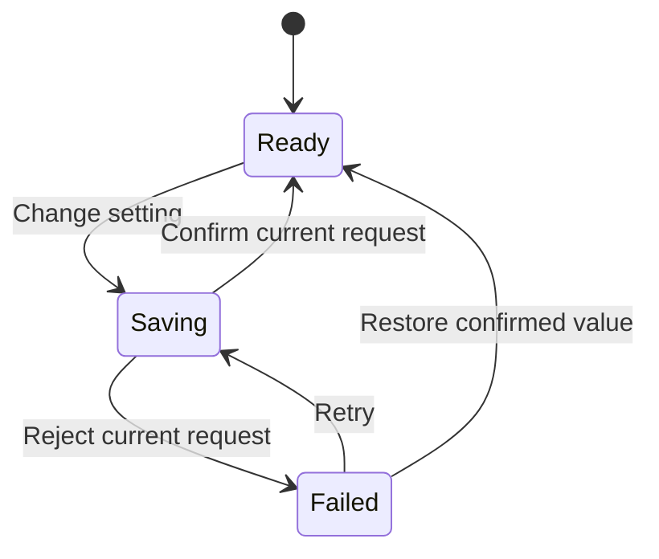

# Reviewable interaction specifications

Define states and acceptance checks before implementing branching or async
behavior. Keep a single-component change in the conversation. Create a short
specification file when transitions coordinate multiple components, a sequence has
multiple stages, the user requests a reviewable spec, or the work is a substantial
redesign. A one-line styling repair needs no spec.

## Transient file convention

Follow repository instructions first. Otherwise use:

```text
.scratch/<effort-slug>/ui/
  review.md
  interactions/I01-short-name.md
```

1. Reuse the folder for the current task. Create only the files needed.
2. For a broad UI review, use `review.md` to record the interface work being reviewed:
   screens and components, inspected states, common tokens, prioritized findings,
   proposed direction, and links to relevant interaction specs.
3. Save decisions needed to reproduce the accepted implementation in the project's
   existing permanent documentation.

### Preserve existing work

- Preserve existing `.scratch/<effort>/spec.md`, `map.md`, `issues/`, and other work.
  Do not relocate or overwrite adjacent planning files.
- Do not create permanent documentation, change ignore rules, or commit scratch
  artifacts unless requested or required by the repository.
- Remove only your own scratch work, after its decisions are retained and it is
  no longer needed for review. Leave it in place while review is pending.

## Specification format

When orchestrating an app or feature, reuse the UX action contract, design-system
component contract, UI treatment, and UX writer's final copy. Link existing flow
or system documents rather than producing competing versions. Each state must
name the same object, consequence, and recovery in the flow, component, and words.
The [orchestration workflow](orchestration.md) defines those handoffs.

Load the relevant visual, interaction-design, and motion references through
`ui-guide`. Record the chosen project tokens or treatment. Then use
[component patterns](component-patterns.md) for ownership and lifecycle,
[animation implementation](animation-implementation.md) for motion mechanics,
and [React/Tailwind](react-tailwind.md) when that stack is involved.
Record decisions, not copies of the design guides.

Use stable IDs such as I01. Keep evidence and implementation status separate:

- Label evidence as observed, code-supported, reported, or assumed.
- Record status as proposed, implemented, or verified.

Include only relevant fields. Record exact chosen values where they affect
implementation. Replace "make it smooth" with specific motion values.

### 1. Describe the component

- Record user intent, frequency of use, product character, scope, and evidence.
- Identify the primary information and action, grouping, and density.
- Name the tokens to reuse or change.

### 2. Define state changes

- For each transition, define the trigger, guard, and next state.
- Specify visible feedback, focus changes, announcements, and interruption behavior.
- Define loops, persistence, and timers.
- Explain cancellation, cleanup on unmount, and handling of stale callbacks.

### 3. Specify motion

- State the purpose, target element, and animated property.
- Give start and end values and the origin.
- Specify duration, delay, and the curve or spring.
- Define the exit and reduced-motion variant.

Use the component's focus rules. Do not substitute a generic focus contract when
the component uses a different valid pattern.

Use a motion table to put the chosen values beside interruption and reduced-motion
behavior. This example assumes the project has no existing menu timing tokens:

| Part             | Change                                                       | Timing                                   | Interruption                                | Reduced motion     |
| ---------------- | ------------------------------------------------------------ | ---------------------------------------- | ------------------------------------------- | ------------------ |
| Anchored surface | Opacity from 0 to 1, scale from 0.98 to 1, origin at trigger | 180ms, existing ease-out token, no delay | Retarget to the latest open or closed state | Show immediately   |
| Surface exit     | Reverse visual change                                        | 120ms                                    | Reopen cancels removal                      | Remove immediately |
| Focus            | Move according to the component's focus rules                | Immediate                                | Restore safely on close                     | Identical behavior |

### Bad and good specifications

Bad: "Make the save interaction smooth and handle errors."

Good, for a form with a single pending submission:

| Event                          | State and feedback                                                 | Input and recovery                                                      |
| ------------------------------ | ------------------------------------------------------------------ | ----------------------------------------------------------------------- |
| Submit valid data              | Set pending immediately; spinner follows the busy-indicator delay. | Guard duplicate submission; retain entered values and focus.            |
| Server confirms save           | Set saved and show the confirmed result.                           | Re-enable submission; preserve current focus.                           |
| Server rejects the save        | Set error and show the associated message.                         | Retain values and allow correction and retry.                           |
| Response is lost after sending | Set unknown; do not claim success or failure.                      | Reconcile status before enabling a retry that could duplicate the save. |

Acceptance check: submit twice before the first response. Confirm that only one
operation is accepted. Reject it and confirm the values remain editable. Repeat
with animations disabled; the same states and recovery must work.

### 4. Record verification and decisions

1. List acceptance checks with concrete actions and observable outcomes. Include
   relevant failures and alternative inputs.
2. Record what was shown, user decisions, open assumptions, and implementation
   status.

## Example filter panel

Request: "Make a filter panel clearer, with live search and a reversible popover."
Assume the project has no relevant visual or motion tokens. If it does, name those
tokens instead. Reuse the installed accessible overlay and query layer.

### Choose appearance

| Concern     | Decision                                                                                                       | Source of the rule                 |
| ----------- | -------------------------------------------------------------------------------------------------------------- | ---------------------------------- |
| Layout      | One column; 8px inside the field, 24px between task groups, wrapping actions. Keep filters after zero results. | Layout guidance in `ui-guide`      |
| Typography  | 20px heading, 16px search input, 14px wrapping status. Preserve result names and units.                        | Typography guidance in `ui-guide`  |
| Iconography | Decorative 20px search glyph from the existing family; active-filter count remains text.                       | Iconography guidance in `ui-guide` |

| Concern | Decision                                                                                                  | Source of the rule                                                |
| ------- | --------------------------------------------------------------------------------------------------------- | ----------------------------------------------------------------- |
| Color   | Raised panel, surface input, primary text, muted status, textual error. Use tested pairs for both themes. | Color guidance in `ui-guide`                                      |
| Surface | 12px panel radius; restrained elevation. Reserve the input's border width in every state.                 | Surfaces guidance in `ui-guide`                                   |
| Motion  | Popover defaults from motion; pending and focus never wait for animation.                                 | [Motion](animation-implementation.md#example-filter-panel-motion) |

### Define behavior and ownership

The overlay owns open state, placement, focus, dismissal, and presence. The query
layer owns request identity, cancellation, and results. The view renders controlled
props from those layers; it does not create a second query or focus system.

| Event                  | Behavior                                                                                                                                         | Visible result                                                                 |
| ---------------------- | ------------------------------------------------------------------------------------------------------------------------------------------------ | ------------------------------------------------------------------------------ |
| Open                   | Apply the overlay's focus contract immediately.                                                                                                  | The panel enters from its trigger; the search field is usable during entrance. |
| Query changes          | Keep typing enabled; only the current query/request can commit results.                                                                          | Keep prior results labeled stale while pending.                                |
| Current query resolves | Clear its pending timer and commit results.                                                                                                      | Announce the result count; keep filters for an empty result.                   |
| Current query fails    | Preserve query and current filter selection.                                                                                                     | Show persistent error text and Retry for that query.                           |
| Close or reopen        | Cancel/invalidate panel reads on close for this example; retain query/filter state outside transient presence. Invalidate old removal on reopen. | A reopened panel remains usable and requests the retained query again.         |

For an app that intentionally continues reads after close, record that choice
instead. Closing a panel is not proof that a server mutation was canceled.
When Retry starts another request, move focus to the search input before hiding
Retry. The view owns this local focus transfer; the overlay owns open/close focus.

### Connect to implementation and checks

Use the [controlled filter view](react-tailwind.md#filter-panel-view). Its props
are the boundary between the existing controllers and the visual component.
The [event trace](component-patterns.md#example-filter-search) defines query ownership;
the [motion treatment](animation-implementation.md#example-filter-panel-motion) defines presence.

| Bad acceptance check         | Good acceptance check                                                                                                    |
| ---------------------------- | ------------------------------------------------------------------------------------------------------------------------ |
| "Search feels responsive."   | Type `ca`, then `cat`; resolve `cat` first and `ca` last. Only `cat` is current and the input never locks.               |
| "The panel closes smoothly." | Close during entrance and reopen during exit. Finish the old exit; the current panel stays mounted and usable.           |
| "Check mobile."              | Narrow the panel, open the keyboard, use long labels, and zoom to 200%. The field, status, and actions remain reachable. |
| "Accessible animation."      | Enable reduced motion. Opening, closing, focus, results, and retry work with no movement.                                |

Status stays Proposed until those checks are exercised. Screenshots demonstrate
appearance; they do not prove request ordering or focus restoration.
Also activate Retry with the keyboard. Confirm focus reaches the search input
before Retry disappears and the input accepts the next keystroke.

## Example confirmed-save feedback

Bad: animate a success checkmark on click and report "Saved" before the server replies.

Good: preserve the button and form values; expose pending immediately; show the
checkmark only after confirmation. A known rejection leaves an editable error.
A lost response produces an unknown state and reconciliation before retry.

Choose persistent feedback from [save states](component-patterns.md#example-save-feedback)
and the glyph and semantic color pair from `ui-guide`,
and the optional swap from [motion](animation-implementation.md#example-contextual-icon-change).
Implement only presentation with the [icon recipe](react-tailwind.md#contextual-icon-recipe);
the data layer still owns whether a save succeeded.

## Mermaid state maps

Use a transition table for a single component. Add Mermaid when multiple branches
rejoin, a mode changes several controls, or event order spans components.

1. Use short stable state IDs and label event edges.
2. Split diagrams when their size makes them hard to read. For redesigns, separate
   current and proposed maps or mark changes unambiguously.
3. Check that diagrams, tables, and code agree about transitions and outcomes.
   Include recovery paths before treating a diagram as ready for implementation.
4. Render the diagram in the conversation for review.

Example for a reversible setting update whose API distinguishes confirmed success
from known rejection. Add an unknown state if its outcome can be uncertain:



### Define request handling alongside the map

- Specify whether to block pending input or let it replace the current request.
- Ignore stale results.
- Preserve the intended choice after failure for retry. Restore the last confirmed
  value when requested.
- If an unknown outcome is possible, add that state and its reconciliation
  transitions. Inspect the operation before labeling a promise rejection "failed."

## Show the experience

Choose evidence that shows the experience:

- For visual design, show the relevant before and after screenshots or prototype.
- For motion, prefer an interactive preview in the existing app or a short recording.
- If only static output is available, show start, key intermediate, and end states
  with timing notes. State that timing and motion quality remain unverified.
  A Mermaid diagram does not prove animation quality.

Once the proposal is concrete, ask for focused feedback on consequential design
choices. If the user already requested implementation, proceed under that
authorization and share the preview for feedback. Do not make every cosmetic
choice a blocking approval.
