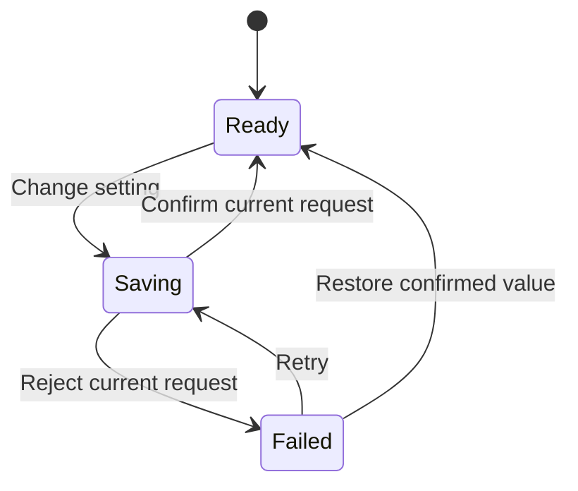

# Reviewable interaction specifications

Use a short specification when a stateful component, coordinated sequence, or substantial redesign needs shared understanding. Do not create a file for a one-line style repair.

## Transient file convention

Follow repository instructions first. Otherwise use:

```text
.scratch/<effort-slug>/ui/
  review.md
  interactions/I01-short-name.md
```

Create only the files needed. Reuse the folder for the current task; preserve existing `.scratch/<effort>/spec.md`, `map.md`, `issues/`, and other work. Do not relocate or overwrite adjacent planning files. Do not create permanent documentation, change ignore rules, or commit scratch artifacts unless requested or required by the repository. Remove only your own scratch work when appropriate. Save decisions needed to reproduce the accepted implementation in the project's existing permanent documentation.

For a broad UI review, `review.md` lists screens and components, inspected states, common tokens, prioritized findings, proposed direction, and links to relevant interaction specs. Keep it scoped to the interface work being reviewed.

## Specification format

Use stable IDs such as I01. Label evidence as observed, code-supported, reported,
or assumed. Record status separately as proposed, implemented, or verified. Include:

1. Describe the component, user intent, frequency, product character, scope, and evidence.
2. Identify the primary information and action, grouping, density, and tokens to reuse or change.
3. Define each trigger, guard, next state, visible feedback, focus change, announcement, and interruption behavior.
4. Specify the motion's purpose, target element and property, start and end values, origin, duration, delay, curve or spring, exit, and reduced-motion variant.
5. Define loops, persistence, timers, cancellation, and cleanup on unmount. Explain how to handle stale callbacks.
6. List acceptance checks with concrete actions and observable outcomes. Include relevant failures and alternative inputs.
7. Record what was shown, user decisions, open assumptions, and implementation status.

Keep irrelevant fields out. Record exact chosen values where they affect implementation; "make it smooth" is not a motion contract.

A motion table can be compact:

| Part             | Change                                                       | Timing                                   | Interruption                                | Reduced motion     |
| ---------------- | ------------------------------------------------------------ | ---------------------------------------- | ------------------------------------------- | ------------------ |
| Anchored surface | Opacity from 0 to 1, scale from 0.98 to 1, origin at trigger | 180ms, existing ease-out token, no delay | Retarget to the latest open or closed state | Show immediately   |
| Surface exit     | reverse visual change                                        | 120ms                                    | Reopen cancels removal                      | Remove immediately |
| Focus            | Move according to the component's focus rules                | Immediate                                | Restore safely on close                     | Identical behavior |

Do not write a shared generic focus contract when the component uses a different valid pattern.

## Mermaid state maps

Use Mermaid when branches, modes, or event ordering make a table difficult to
follow. Render the diagram in the conversation for review. Use short stable state
IDs and label event edges. Split diagrams when their size makes them hard to read.

Example for a reversible local setting update:



Alongside the diagram, specify whether to block pending input or let it replace the current request. Ignore stale results, preserve the intended choice after failure for retry, and restore the last confirmed value when requested. If an unknown outcome is possible, add that state and its reconciliation transitions. Do not label all promise rejections "failed" without inspecting the operation.

For redesigns, separate current and proposed maps or mark changes unambiguously. Diagrams, tables, and code must agree about transitions and outcomes. A nice-looking diagram with missing recovery paths is not ready for implementation.

## Show the experience

For visual design, show the relevant before/after screenshot or prototype. For motion, prefer an interactive preview in the existing app or a short recording. When only static output is available, show start, key intermediate, and end states with timing notes, and state that timing and motion quality remain unverified. Do not claim a Mermaid diagram proves animation quality.

Ask for focused feedback on consequential design choices after making the proposal concrete. If the user already requested implementation, proceed under that authorization and share the preview for feedback; do not make every cosmetic choice a blocking approval.
