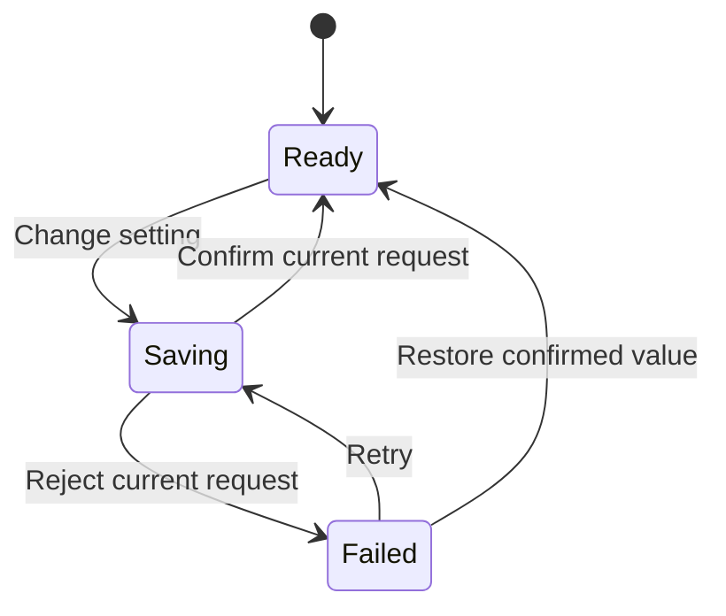

# Reviewable interaction specifications

Use a short specification when a stateful component, coordinated sequence, or substantial redesign needs shared understanding. Do not create a file for a one-line style repair.

## Transient file convention

Follow repository instructions first. Otherwise use:

```text
.scratch/<effort-slug>/ui/
  review.md
  interactions/I01-short-name.md
```

Create only the files needed. Reuse a matching effort; preserve existing `.scratch/<effort>/spec.md`, `map.md`, `issues/`, and other work. Do not relocate or overwrite adjacent planning files. Do not create permanent documentation, change ignore rules, or commit scratch artifacts unless requested or required by the repository. Retire only your own scratch work when appropriate; retain decisions needed to reproduce the accepted implementation in the project's existing durable conventions.

For a broad UI review, `review.md` lists surfaces, inspected states, common tokens, prioritized findings, proposed direction, and links to relevant interaction specs. It is a coverage map for interface work, not a requirement to model the entire product.

## Specification format

Use stable IDs such as I01. Keep evidence such as **observed**, **code-supported**,
**reported**, or **assumed** separate from status such as **proposed**,
**implemented**, or **verified**. Include:

1. **Goal and context:** component, user intent, frequency, product character, scope, and evidence.
2. **Visual hierarchy:** primary information/action, grouping, density, tokens reused or changed.
3. **States and transitions:** trigger, guard, next state, visible feedback, focus/announcement, and interruption behavior.
4. **Motion contract:** purpose, target/property, start/end values, origin, duration/delay/curve or spring, exit, reduced-motion variant.
5. **Repeated use and cleanup:** loops, persistence, timers, cancellation, unmount, stale callbacks.
6. **Acceptance checks:** concrete actions and observable outcomes; include relevant failure and alternative input.
7. **Feedback record:** what was shown, user decisions, assumptions left open, implementation status.

Keep irrelevant fields out. Record exact chosen values where they affect implementation; "make it smooth" is not a motion contract.

A motion table can be compact:

| Part             | Change                                      | Timing                                   | Interruption                          | Reduced motion     |
| ---------------- | ------------------------------------------- | ---------------------------------------- | ------------------------------------- | ------------------ |
| Anchored surface | opacity 0→1, scale .98→1, origin at trigger | 180ms, existing ease-out token, no delay | Retarget on close; newest intent wins | Show immediately   |
| Surface exit     | reverse visual change                       | 120ms                                    | Reopen cancels removal                | Remove immediately |
| Focus            | Move according to primitive contract        | Immediate                                | Restore safely on close               | Identical behavior |

Do not write a shared generic focus contract when the actual primitive uses a different valid pattern.

## Mermaid state maps

Use Mermaid when branches, modes, or event ordering make a table difficult to
follow. Render the diagram in the conversation for review. Use short stable state
IDs and label event edges. Split diagrams when their size makes them hard to read.

Example for a reversible local setting update:



The diagram requires a companion contract: pending input is guarded or superseded explicitly; stale results are ignored; failure preserves the intended choice for retry; restore uses the last confirmed value. If an unknown outcome is possible, add that state and its reconciliation transitions. Do not label all promise rejections "failed" without inspecting the operation.

For redesigns, separate current and proposed maps or mark changes unambiguously. Diagrams, tables, and code must agree about transitions and outcomes. A nice-looking diagram with missing recovery paths is not ready for implementation.

## Show the experience

For visual design, show the relevant before/after screenshot or prototype. For motion, prefer an interactive preview in the existing app or a short recording. When only static output is available, show start, key intermediate, and end states with timing notes, and state that feel remains unverified. Do not claim a Mermaid diagram proves animation quality.

Ask for focused feedback on consequential design choices after making the proposal concrete. If the user already requested implementation, proceed under that authorization and share the preview for feedback; do not make every cosmetic choice a blocking approval.
