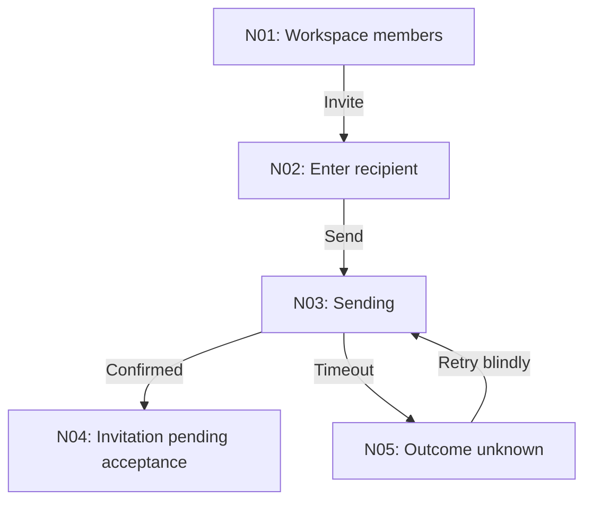
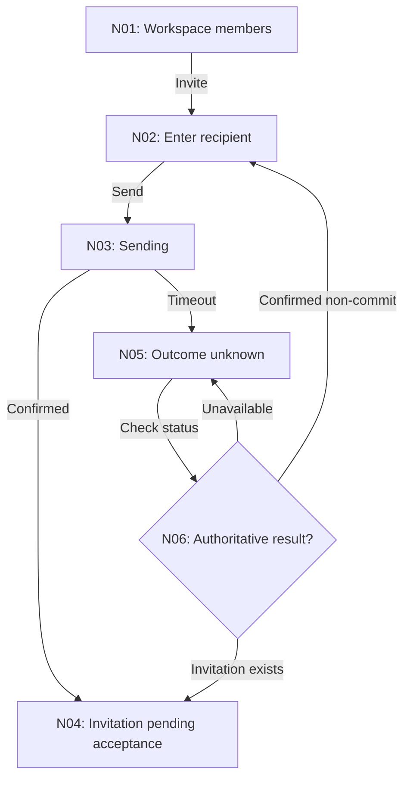

# Map current and proposed flows

Identify the task's entry, commitment, completion, and recovery before drawing
arrows. Keep the observed baseline separate from the proposed change. Use stable
IDs so findings, implementation, and checks refer to the same transition.

## Choose the map size

| Task                                     | Output                                                                          |
| ---------------------------------------- | ------------------------------------------------------------------------------- |
| A trivial linear action                  | A short table or prose in the conversation.                                     |
| A changed branch or multi-screen journey | One flow map with its transition and recovery contract.                         |
| A whole-app audit                        | An overview of journeys and detailed maps for the consequential paths in scope. |

Render the overview and changed branching flows in the conversation. When working
files are permitted, use the storage rules below. If the user requested no file
changes, keep the maps in the conversation.

## Storage and lifetime

1. Read project instructions and existing scratch notes. Reuse the current effort,
   domain terms, and IDs instead of starting a second set of artifacts.
2. For working files, default to `.scratch/<effort-slug>/ux/` in the application repo.
3. Put the journey inventory, overview, coverage, and flow links in `overview.md`.
   Put a journey's current/proposed maps and checks in `flows/<flow-id>-<slug>.md`.
4. Use the existing feature slug. For a whole-app audit without an effort folder,
   use `ux-audit`. Without a repo, use the session's temporary workspace and state
   what the map covers.

A narrow task does not need an overview file. Create only the artifacts needed
for its agreed scope.

### Preserve adjacent specs and tickets

- Keep UX maps separate from existing `.scratch/<feature>/spec.md`, `map.md`, and
  `issues/<NN>-<slug>.md`.
- Link to canonical specs and tickets; do not overwrite them, duplicate their
  content, reset IDs, or treat a flow map as an implementation ticket.
- Create tickets only when explicitly requested and use the project's tracker
  conventions. Existing local Markdown tickets retain their numbering and status vocabulary.

### Preserve transient work

- Follow existing ignore rules without silently editing `.gitignore` or requiring
  a setup skill. Exclude transient maps from product commits by default.
- Do not assume everything under `.scratch/` is disposable; it may contain tickets.
- Retain active maps through the work or handoff. Remove only this task's transient
  files when cleanup is requested or established convention requires it.
- Do not automatically publish, archive, or commit scratch notes.

## Whole-app inventory

Inventory routes and visible navigation, then group them by the jobs people
complete. Include direct links, notifications, invitations, role gates, returning
sessions, and external handoffs supported by the app.

| Flow ID / name       | Person and job                     | Entry and return points                      | Completion and connections                  | Evidence / coverage                                                 |
| -------------------- | ---------------------------------- | -------------------------------------------- | ------------------------------------------- | ------------------------------------------------------------------- |
| F01: Workspace setup | Owner prepares a usable workspace. | First sign-in or return to unfinished setup. | Workspace ready; continue to the core task. | Label observed, code-supported, reported, inferred, or uninspected. |

A route list alone is not a journey inventory. Diagram how journeys connect,
including role gates and re-entry. Split large overviews by activity or role,
keeping an index of every agreed area. Name uninspected areas and access limits;
do not claim an app-wide audit from one happy-path walkthrough.

## Per-flow document format

Use the template below for a working flow document. Fill actual scope and evidence;
omit a section only when it does not apply. The hypothetical current map deliberately
shows an unsafe retry. It is a bad example to repair, not an implementation recipe.

````markdown
# F02: Invite a teammate

Status: proposed
Revision: 1
Scope: workspace member invitation
Evidence: code-supported; browser walkthrough pending
Basis: inspected revision or date, relevant routes/components
Related: [Workspace setup](../overview.md), [Existing spec](../../spec.md)

## Job and contract

Actor and permissions; entry points; intended outcome; commitment boundary;
affected scope; what can be canceled or reversed; assumptions.

## Current flow



## Findings

| ID / node   | Evidence and user difficulty               | Cause                             | Change                           | Priority |
| ----------- | ------------------------------------------ | --------------------------------- | -------------------------------- | -------- |
| UX-01 / N05 | Timeout offers resend with no status check | Unknown result treated as failure | Reconcile before allowing resend | High     |

## Proposed flow



## Transition contract

| From / event       | Guard and effect              | To / feedback  | Work and focus                        | Failure / recovery                                              |
| ------------------ | ----------------------------- | -------------- | ------------------------------------- | --------------------------------------------------------------- |
| N05 / check status | Requires authoritative lookup | N06 / checking | Preserve recipient; keep focus stable | Remain unresolved if lookup fails; do not assume resend is safe |

## Decisions and feedback

D01: Status lookup is required for safe retry. Backend support is unverified.
Open: Identify available invitation-status contract before implementation.
Feedback: No user feedback received yet.

## Acceptance and verification

- Given an invitation succeeded but the response was lost, status recovery
  finds that invitation without sending another.
- Invitation sent does not imply recipient joined the workspace.
- Status: not exercised. Record actual result and evidence after verification.
````

The example isolates one failure branch. A real invitation flow also needs its
validation, permission, cancellation, and return paths. Record backend dependencies.

A status lookup permits another send only if its contract establishes non-commit
and rules out late completion. A temporarily missing record is not enough. Keep
the result unknown when that evidence is unavailable.

### Use status labels precisely

| Status        | Evidence required                                           |
| ------------- | ----------------------------------------------------------- |
| `current`     | The recorded baseline and its stated evidence source.       |
| `proposed`    | A future treatment; no claim of approval or implementation. |
| `agreed`      | Actual user feedback or a cited existing decision.          |
| `implemented` | The change exists in code; runtime checks may remain.       |
| `verified`    | Named scenarios were exercised and their results recorded.  |

Silence is not agreement. Preserve the baseline and distinguish an implemented
proposal from an exercised result. Verification covers only the listed scenarios.

## Mermaid conventions

### Name states and transitions

- Default to `flowchart TD` for a journey. Use a state diagram for one object's
  lifecycle when that is what the task needs.
- Show user-visible states, screens, and decisions, not JSX hierarchy. Label edges
  with actions, events, or meaningful conditions.
- Use stable flow IDs such as `F01` and node IDs such as `N01`. Preserve an ID
  for the same concept across current and proposed maps; allocate new IDs for new concepts.
- Quote short human-facing labels. Use braces for decisions and rectangles for
  states. Keep implementation detail in the transition table.
- Use solid edges for specified behavior and dotted edges for explicitly labeled
  conditional or unknown links. Do not use color alone to encode meaning.

### Keep the map complete and readable

1. Include commitment, completion, alternate paths, recovery, and return behavior
   that the real system supports.
2. Make every decision branch to its actual possible outcomes. A status lookup
   must not always route to success or processing.
3. Check that the diagram and transition table agree. Fix the edge instead of
   explaining a contradiction in prose.
4. Keep each diagram focused on one journey or branch. Split when labels or edge
   crossings are hard to follow; use at most five nodes across. Do not add HTML
   labels, click directives, or embedded diagram configuration.

| Bad                                                          | Good                                                                       |
| ------------------------------------------------------------ | -------------------------------------------------------------------------- |
| A status check always leads to Processing.                   | Branch to confirmed success, confirmed non-commit, or still unknown.       |
| An error arrow leads to Retry without a safety condition.    | State the condition that makes retry safe and preserve the unknown branch. |
| A changed node gets a new ID only because its label changed. | Preserve the ID when it represents the same concept.                       |
| A map is called verified because Mermaid renders.            | Record syntax separately from exercised product behavior.                  |

## Feedback and implementation loop

1. Show the current map and evidence limits, then the proposed change and the
   decisions that matter. For a large audit, start with the overview.
2. Render the branching map in the conversation. Ask only about unresolved product
   choices that change behavior; do not seek blanket approval for already-authorized repairs.
3. Record actual feedback against the relevant node or decision. Honor a requested
   checkpoint. When orchestrated, inherit the agreed scope, approach, and readiness.
4. If implementation is authorized, connect each repair to its transition and
   acceptance check. Record deviations and backend dependencies as they appear.
5. Reconcile the map with implemented behavior. Mark checks verified only after
   exercising them, and report unresolved paths. Reuse these artifacts when resuming.

A design or audit handoff can finish with a proposed map and evidence limits.
A requested repair is not complete merely because the proposed map is finished.
