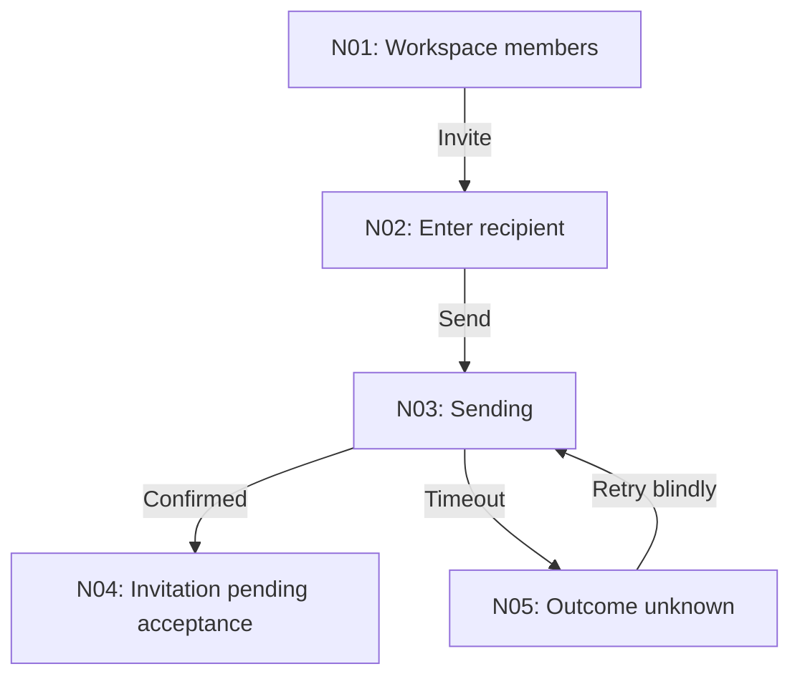
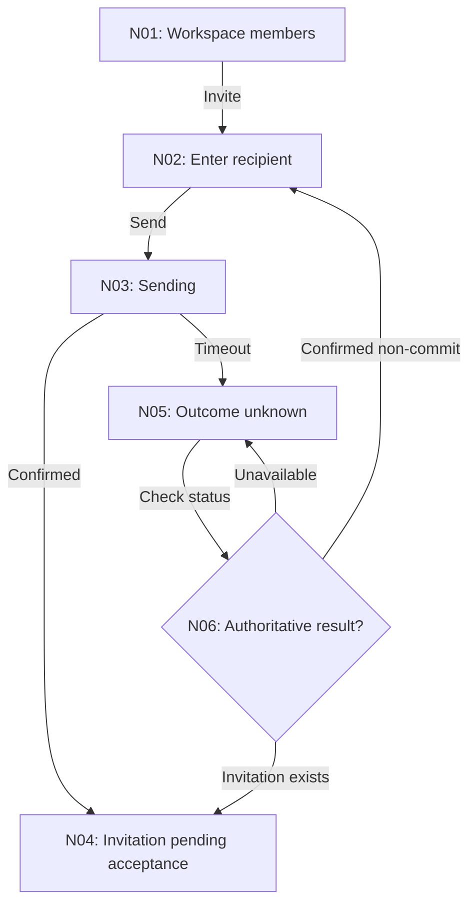

# Transient flow maps

Find the current task's scratch folder and existing flow map before creating
files. Map current behavior separately from the proposed repair.

## Storage and lifetime

Read project instructions and existing scratch notes first. Reuse the current effort folder and domain terms. Default to `.scratch/<effort-slug>/ux/` inside the application repository:

- `overview.md`: app context, journey inventory, overview diagrams, coverage, and named links to detailed flows.
- `flows/<flow-id>-<slug>.md`: current and proposed behavior, transitions, findings, decisions, and checks for one journey.

For a whole-app effort, a suitable slug is `ux-audit`; for an existing feature, reuse its feature slug. A narrow task can use one flow document without a full overview. When no repository exists, use the session's temporary workspace with the same relative structure and say what context the map covers.

### Preserve adjacent specs and tickets

Keep these separate from existing `.scratch/<feature>/spec.md`, `map.md`, and `issues/<NN>-<slug>.md` conventions. Those may already be canonical specs, decision maps, or tickets. Link to them by descriptive title; do not overwrite them, duplicate their content, reset numbering, or treat UX map files as tickets. If implementation tickets are explicitly requested, follow the project's configured tracker; for local Markdown, use individual numbered issue files and its existing status vocabulary.

### Keep transient files under the existing policy

Do not create repository configuration or require a setup skill to use these notes. Respect ignore rules; exclude transient maps from product commits by default without silently editing `.gitignore`. Do not assume all of `.scratch/` is disposable. It may contain the project's issue tracker. Retain active maps until the work or handoff is complete; remove only this task's transient files when cleanup is requested or established convention requires it. Do not automatically publish, archive, or commit scratch notes.

## Whole-app inventory

Inventory routes and visible navigation, then group them into user journeys. A route list alone is not a flow map. Include direct links, notifications, invited users, returning sessions, role differences, and external handoffs where supported.

Record:

| Flow      | Person/role and job | Entry points                  | Outcome and exit      | Connections             | Coverage                                           |
| --------- | ------------------- | ----------------------------- | --------------------- | ----------------------- | -------------------------------------------------- |
| F01: Name | Who wants what      | App route or external trigger | Observable completion | Named next/return flows | Observed, code-supported, reported, or uninspected |

At app level, diagram how journeys connect, including re-entry and role gates. Split large apps by activity or role; keep an index linking every area. Use one overview per coherent area so each diagram remains readable. Cover the inspected app in an overview and document important paths in detail. Explicitly name missing areas and access limits before calling an audit complete.

## Per-flow document format

Use the following structure, omitting sections only when they do not apply. Fill concrete values rather than leaving template placeholders.

````markdown
# F02: Invite a teammate

Status: proposed
Revision: 1
Scope: workspace member invitation
Evidence: code-supported; browser walkthrough pending
Basis: inspected revision or date, relevant routes/components
Related: [Workspace setup](../overview.md), [Existing spec](../../spec.md)

## Job and contract

Actor and permissions; entry points; intended outcome; commitment boundary;
affected scope; what can be canceled or reversed; assumptions.

## Current flow



## Findings

| ID / node   | Evidence and user difficulty               | Cause                             | Change                           | Priority |
| ----------- | ------------------------------------------ | --------------------------------- | -------------------------------- | -------- |
| UX-01 / N05 | Timeout offers resend with no status check | Unknown result treated as failure | Reconcile before allowing resend | High     |

## Proposed flow



## Transition contract

| From / event       | Guard and effect              | To / feedback  | Work and focus                        | Failure / recovery                                              |
| ------------------ | ----------------------------- | -------------- | ------------------------------------- | --------------------------------------------------------------- |
| N05 / check status | Requires authoritative lookup | N06 / checking | Preserve recipient; keep focus stable | Remain unresolved if lookup fails; do not assume resend is safe |

## Decisions and feedback

D01: Status lookup is required for safe retry. Backend support is unverified.
Open: Identify available invitation-status contract before implementation.
Feedback: No user feedback received yet.

## Acceptance and verification

- Given an invitation succeeded but the response was lost, status recovery
  finds that invitation without sending another.
- Invitation sent does not imply recipient joined the workspace.
- Status: not exercised. Record actual result and evidence after verification.
````

The example isolates one failure branch; a real invitation flow also needs its applicable validation, permission, cancellation, and return behavior. Include backend dependencies rather than silently assuming them. A lookup can authorize a new send only when its contract establishes non-commit and rules out a late completion; a temporary missing record is not sufficient.

Use flow status `current`, `proposed`, `agreed`, `implemented`, or `verified` accurately. `Agreed` requires actual user feedback or a cited existing decision; silence is not agreement. `Verified` covers only the scenarios actually exercised, which must be listed. Preserve a useful baseline; do not relabel a proposal as current merely because code was written.

## Mermaid conventions

### Name states and transitions

- Prefer `flowchart TD`. Use a state diagram for a local state lifecycle when that is clearer.
- Represent user-visible states, screens, and real decisions; use edge labels for actions, events, and meaningful conditions. Do not diagram JSX component hierarchy as a user journey.
- Give flows stable `F01` identifiers and nodes stable `N01` identifiers within each flow. Identify findings and tests with both. Preserve identifiers for the same concept between current and proposed diagrams; allocate new IDs for new concepts.
- Quote labels, use short human-facing names, and keep implementation details in the transition table. Use `{}` for decisions, `[]` for states, and labeled edges for outcomes.
- Use solid edges for specified behavior; dotted edges may denote explicitly labeled unknown or conditional links. Do not use color alone to communicate meaning.

### Keep the map complete and readable

- Include realistic alternate paths, commitment, completion, and return/resume behavior. Do not add impossible recovery just to make the graph tidy.
- Make diagrams and transition tables agree. Do not use prose to excuse an incorrect edge. A status lookup must branch to the possible authoritative states; do not always route it to processing when it may return completed or failed. Group detail in a named subflow when necessary.
- Keep diagrams scoped, usually around 5–12 meaningful nodes; split before legibility suffers. Avoid more than five nodes across, use no HTML labels, click directives, or embedded diagram configuration.
- Use tables or prose for trivial linear actions where a diagram adds no understanding. The overview and changed branching flows still need to be rendered for review.

## Feedback and implementation loop

1. Show the current map and evidence limits, then the proposed changed path and the few decisions that matter. For large audits, show the overview first and review details in manageable groups.
2. Render Mermaid in the conversation, not only in a file. Explain why a changed branch addresses a finding. Ask a specific question only when the answer would change behavior; do not ask for blanket approval of obvious repairs already authorized.
3. Record actual feedback and update the relevant node, transition, and decision. When the user requested a review checkpoint, wait there. Otherwise continue authorized implementation with stated assumptions.
4. Implement against the transition contract. Link each finding to the proposed node or transition and its acceptance check. Record deviations and backend dependencies as they arise.
5. Reconcile the map with the implemented flow and mark checks verified only after exercising them. Summarize unresolved paths. Reuse the same documents when resuming the effort; check that they still describe the code.
